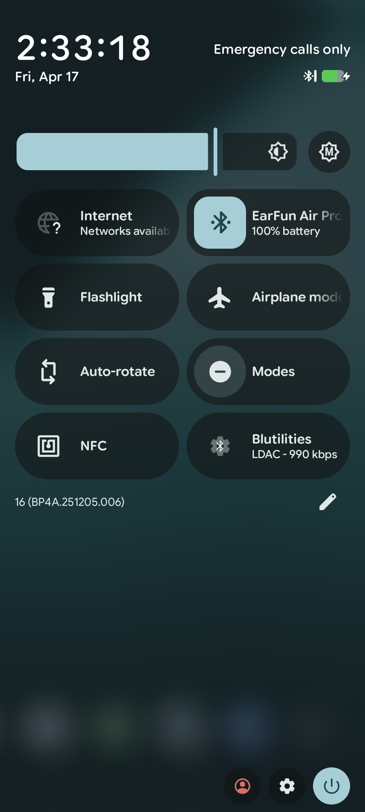
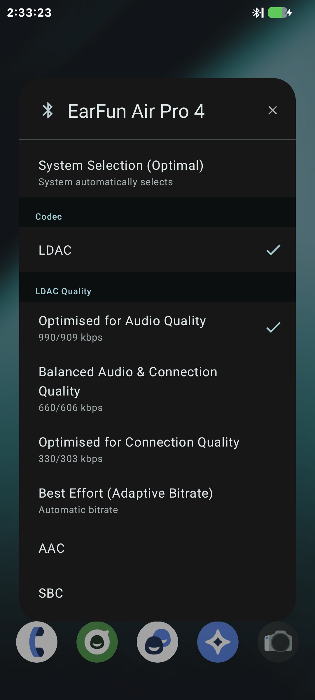

[English](README.md) | **Magyar**

  
  <h1 align="center">Blutilities</h1>

  <strong>Bluetooth audio kodekek kezelése közvetlenül a Gyorsbeállításokból.</strong>

 

## Áttekintés

A **Blutilities** egy könnyű, a Material Design ihlette Android segédprogram, amely megkönnyíti a Bluetooth-hangélmény kezelését. Ahelyett, hogy az Android Fejlesztői beállításokban kellene minden alkalommal kutatni, a Blutilities egy kényelmes **Gyorsbeállítások csempét** biztosít, amellyel pillanatok alatt válthatsz az aktív audiokodekek között. 

Az alkalmazást audiofilek számára tervezték, és széles körű támogatást nyújt a nagy felbontású kodekekhez – különösen az **LDAC**-hez –, lehetővé téve, hogy könnyedén meghatározd a lejátszási minőségeket (pl. 990 kbps, 660 kbps) a csatlakoztatott A2DP-eszközökön.

## Főbb jellemzők

* 🎛️ **Gyorsbeállítások integrációja:** Egy érintéssel elérhető az aktív Bluetooth-hangkonfiguráció.
* 🎧 **Intelligens kodekváltás:** Azonnali váltás az SBC, AAC, aptX, aptX HD és LDAC között.
* ⚡ **Részletes LDAC-vezérlés:** A rendszer alapértelmezett beállításait felülírva, manuálisan kiválasztható a kívánt LDAC lejátszási minőség (990 kbps, 660 kbps, 330 kbps vagy Adaptív).
* 🎨 **Material Design felhasználói felület:** Modern, letisztult párbeszédablak-stílusú felület, amely teljesen natívnak tűnik az Android rendszeren.
* 🧠 **Kontextusérzékeny:** A csempe dinamikusan frissíti állapotát, és csak akkor aktív, ha egy támogatott Bluetooth A2DP-eszköz csatlakozik.

## Támogatott nyelvek
* Angol
* Magyar

Fordításokat szívesen fogadok.

## Képernyőképek

   &nbsp;&nbsp;&nbsp;&nbsp;
  

## Használat

1. Telepítsd az alkalmazást.
2. Húzd le kétszer az ujjad a kiterjesztett Gyorsbeállítások panel megnyitásához.
3. Érintsd meg az **Szerkesztés** (ceruza) ikont.
4. Keresd meg a **Blutilities** alkalmazást a rendelkezésre álló csempék között, és húzd át az aktív csempék területére.
5. Csatlakoztasd a Bluetooth fejhallgatót/fülhallgatót.
6. Érintsd meg a csempét a kodekválasztó párbeszédablak megnyitásához, és válaszd ki a kívánt hangminőséget!

## Engedélyek

A Blutilities megfelelő működéséhez a `BLUETOOTH_CONNECT` engedélyre van szükség (Android 12+ esetén), hogy felismerje a csatlakoztatott eszközöket, leolvassa azok támogatott képességeit, és alkalmazza a kívánt audiokodek-beállításokat.

---
*Kotlin nyelven készült.*